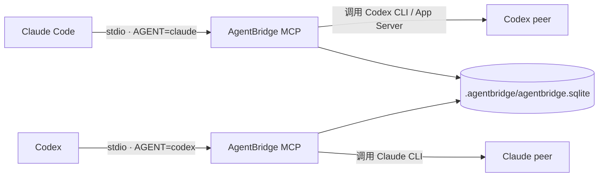

# AgentBridge

AgentBridge 是一个本地优先的 MCP 协作核心，让 Claude Code 和 Codex 能在同一个项目中互相提问、回复、重试、达成一致，并把讨论状态保存在项目本地的 SQLite 数据库中。

> 当前版本：v0.3 工程实现，npm 包版本为 `0.1.0`。它适合本地开发和集成验证；签名 EXE、自动更新、云端部署等仍未完成。

## 目录

- [它如何工作](#它如何工作)
- [当前功能与边界](#当前功能与边界)
- [虚拟机快速开始](#虚拟机快速开始)
- [配置 Claude 和 Codex](#配置-claude-和-codex)
- [首次真实联通测试](#首次真实联通测试)
- [MCP 工具说明](#mcp-工具说明)
- [讨论状态说明](#讨论状态说明)
- [管理命令](#管理命令)
- [环境变量](#环境变量)
- [更新到最新版](#更新到最新版)
- [备份、恢复与卸载](#备份恢复与卸载)
- [常见问题](#常见问题)
- [开发与发布](#开发与发布)
- [安全说明](#安全说明)

## 它如何工作

Claude Code 和 Codex 各自启动一个短生命周期的 stdio MCP 进程。两个 MCP 进程共享项目中的 SQLite 数据库，但各自代表不同的代理身份。



AgentBridge 不会把代码或讨论上传到自己的云服务。实际模型请求仍由本机安装并已登录的 Claude/Codex 客户端发送给各自的服务商。

## 当前功能与边界

已实现：

- 使用 Node 内置 `node:sqlite` 的 SQLite WAL 存储。
- 双 MCP 进程共享讨论、消息、决定、审计事件和会话租约。
- `ask_peer`、`reply_peer`、`get_discussion`、`list_discussions`、`close_discussion`、`cancel_discussion`、`retry_discussion` 七个 MCP 工具。
- Claude CLI 新会话和 `--resume` 会话续接。
- Codex CLI `exec --json` 和 `exec resume` 会话续接。
- 显式配置的 Codex App Server stdio 适配器。
- 讨论轮数、重试次数、总消息长度和持续时间限制。
- `init`、`setup`、`doctor`、`status`、`register-session`、`update` 和 `uninstall` 管理命令。
- 增量修改 Claude JSON 与 Codex TOML 配置，修改前生成备份。
- 并发 SQLite 启动锁等待与双进程回归测试。

当前边界：

- 必须在运行 AgentBridge 的系统或虚拟机内安装并登录 Claude/Codex；宿主机登录状态不会自动进入虚拟机。
- Codex App Server 适配器会启动一个新的受控子进程，不会接管已打开的 Codex Desktop 私有进程。
- 尚无常驻 HTTP 服务、Web UI、PostgreSQL/Redis、严格模式或等待队列。
- 完整崩溃恢复、签名原生 EXE、自动更新和云端部署仍是后续工作。
- 是否能完成真实调用最终取决于本机 provider 版本、账号权限、网络和模型配额。

## 虚拟机快速开始

以下命令以 Linux/bash 为主。PowerShell 可执行同样的 `git`、`npm` 和 `node` 命令，只需把路径换成 Windows 路径。

### 1. 检查必需软件

```bash
git --version
node --version
npm --version
claude --version
codex --version
```

要求：

- Node.js `22.13` 或更高版本。
- Git。
- 至少安装要被调用的 provider CLI。完整双向协作建议同时安装 Claude CLI 和 Codex CLI。
- Claude/Codex 已在虚拟机内完成登录，并能各自单独执行一次普通请求。

如果 `node --version` 低于 `v22.13.0`，先升级 Node。Node 22.5–22.12 的 `node:sqlite` 默认仍需要实验开关，不在本项目支持范围内。

### 2. 获取或更新代码

首次下载：

```bash
git clone --branch main --single-branch https://github.com/HeadStone1/AgentBridge.git
cd AgentBridge
```

已经克隆过：

```bash
cd AgentBridge
git pull --ff-only origin main
```

确认版本：

```bash
git log -1 --oneline
```

### 3. 安装依赖并构建

```bash
npm install
npm test
npm run build
```

测试成功时应看到所有测试通过。构建产物位于各 package 的 `dist/` 目录。

### 4. 初始化项目

在 AgentBridge 仓库目录运行：

```bash
node packages/cli/dist/index.js setup .
```

该命令会：

1. 创建 `.agentbridge/project.json`。
2. 在需要时创建 `.agentbridge/agentbridge.sqlite`。
3. 增量更新 `~/.claude.json`。
4. 增量更新 `~/.codex/config.toml`。
5. 修改已有配置前创建 `*.agentbridge.bak` 备份。

如果只想初始化本地状态、不修改 provider 配置：

```bash
node packages/cli/dist/index.js setup . --no-config
```

如果使用非默认配置文件：

```bash
node packages/cli/dist/index.js setup . \
  --claude-config /path/to/claude.json \
  --codex-config /path/to/config.toml
```

### 5. 运行诊断

```bash
node packages/cli/dist/index.js doctor .
node packages/cli/dist/index.js status .
```

重点检查 `doctor` 输出：

- `node.supported` 应为 `true`。
- `providers.claudeCli` 应在使用 Claude CLI 时为 `true`。
- `providers.codexCli` 应在使用 Codex CLI 时为 `true`。
- 使用 App Server 时，`providers.codexAppServer` 应为 `true`。
- `database.readable` 应为 `true`。

## 配置 Claude 和 Codex

### 代理身份非常重要

两个 MCP 进程使用同一入口文件，但必须拥有不同的 `AGENTBRIDGE_AGENT`：

| 宿主 | 必需值 | 对端 |
|---|---|---|
| Claude Code | `AGENTBRIDGE_AGENT=claude` | Codex |
| Codex | `AGENTBRIDGE_AGENT=codex` | Claude |

当前 v0.3 的 `setup` 会生成基础 MCP 条目。执行后必须检查两个配置中的 `env`，确保分别存在上表中的身份值。如果缺失，请按下面示例补充。修改配置后重启 Claude Code 和 Codex。

### Claude 配置示例

默认文件：

- Linux/macOS：`~/.claude.json`
- Windows：`C:\Users\<用户名>\.claude.json`

只展示 AgentBridge 相关部分：

```json
{
  "mcpServers": {
    "agentbridge": {
      "command": "/absolute/path/to/node",
      "args": [
        "/absolute/path/to/AgentBridge/packages/mcp/dist/cli.js"
      ],
      "env": {
        "AGENTBRIDGE_AGENT": "claude",
        "AGENTBRIDGE_DB_PATH": "/absolute/path/to/AgentBridge/.agentbridge/agentbridge.sqlite"
      }
    }
  }
}
```

保留文件中已有的其他字段和 MCP 服务，不要用示例覆盖整个文件。JSON 中的 Windows 反斜杠必须写成 `\\`，或者使用正斜杠路径。

### Codex 配置示例

默认文件：

- Linux/macOS：`~/.codex/config.toml`
- Windows：`C:\Users\<用户名>\.codex\config.toml`

```toml
[mcp_servers.agentbridge]
command = '/absolute/path/to/node'
args = ['/absolute/path/to/AgentBridge/packages/mcp/dist/cli.js']
env.AGENTBRIDGE_AGENT = 'codex'
env.AGENTBRIDGE_DB_PATH = '/absolute/path/to/AgentBridge/.agentbridge/agentbridge.sqlite'
```

Claude 和 Codex 的 `AGENTBRIDGE_DB_PATH` 必须指向同一个文件，否则双方看不到同一场讨论。建议使用绝对路径，尤其是在虚拟机、容器或从不同工作目录启动 provider 时。

可用以下命令取得绝对路径：

```bash
which node
pwd
```

PowerShell：

```powershell
(Get-Command node).Source
(Get-Location).Path
```

### 使用 Codex App Server

仅当没有可用的 Codex CLI、但某个可执行文件明确支持 `app-server --stdio` 时使用：

```bash
node packages/cli/dist/index.js setup . \
  --codex-app-command /absolute/path/to/codex-executable
```

也可以设置：

```bash
export AGENTBRIDGE_CODEX_APP_COMMAND=/absolute/path/to/codex-executable
```

这不会连接到已经打开的 Codex Desktop 私有会话，而是启动新的受控 App Server 子进程。

## 首次真实联通测试

完成配置后，完全退出并重新启动 Claude Code 和 Codex，使 MCP 配置重新加载。

### 从 Claude 发起

在 Claude Code 中输入类似请求：

```text
请使用 AgentBridge 的 ask_peer 工具询问 Codex：
检查当前项目的 README，并用一句话回复是否能正常读取项目。
```

Claude 调用的工具参数应类似：

```json
{
  "peer": "codex",
  "message": "检查当前项目的 README，并用一句话回复是否能正常读取项目。",
  "projectPath": "/absolute/path/to/AgentBridge"
}
```

成功响应通常包含：

- `discussionId`，例如 `dsc_...`。
- `messageId`。
- `status: "DISCUSSING"`。
- provider 可用时的 `peerResponse`。

### 从 Codex 发起

在 Codex 中输入：

```text
请使用 AgentBridge 的 ask_peer 工具询问 Claude：
总结 package.json 中提供的 npm scripts。
```

Codex 侧 `peer` 必须是 `claude`。

### 检查持久化结果

```bash
node packages/cli/dist/index.js status .
```

也可以让任一代理调用：

```json
{
  "name": "list_discussions",
  "arguments": {
    "projectPath": "/absolute/path/to/AgentBridge"
  }
}
```

如果真实调用失败，讨论记录仍可能保存为 `PEER_BUSY`、`FAILED` 或 `TIMEOUT`，可通过 `status` 或 `get_discussion` 查看。

## MCP 工具说明

### `ask_peer`

开始一场新讨论，并调用另一代理。

```json
{
  "peer": "codex",
  "message": "请审查这个实现方案。",
  "projectPath": "/project/path"
}
```

- Claude 侧只能选择 `codex`。
- Codex 侧只能选择 `claude`。
- `projectPath` 可省略，默认使用 MCP 进程当前工作目录。
- 返回的 `discussionId` 用于后续所有操作。

### `reply_peer`

继续已有讨论，并把回复发送给另一参与者。

```json
{
  "discussionId": "dsc_xxxxxxxxxxxx",
  "message": "我接受第一点，但建议修改超时策略。"
}
```

发送者由当前 MCP 宿主身份决定，不需要在参数中指定。

### `get_discussion`

读取讨论详情、全部消息以及最终决定。

```json
{
  "discussionId": "dsc_xxxxxxxxxxxx"
}
```

### `list_discussions`

列出讨论。可按项目路径过滤：

```json
{
  "projectPath": "/project/path"
}
```

不传 `projectPath` 时会列出当前数据库中的全部讨论。

### `close_discussion`

记录当前代理对结论的接受：

```json
{
  "discussionId": "dsc_xxxxxxxxxxxx",
  "conclusion": "采用 WAL，并在申请写锁前设置有界等待。"
}
```

重要规则：

- 两个代理必须分别调用一次。
- 两次提交的 `conclusion` 必须完全一致，包含空格、标点和大小写。
- 只有双方接受同一结论后，状态才会变为 `COMPLETED` 并生成决定记录。

### `cancel_discussion`

取消讨论并释放本地会话租约：

```json
{
  "discussionId": "dsc_xxxxxxxxxxxx"
}
```

### `retry_discussion`

在 `FAILED`、`PEER_BUSY`、`TIMEOUT` 或 `NEEDS_USER_DECISION` 后，重新派发最后一条消息：

```json
{
  "discussionId": "dsc_xxxxxxxxxxxx"
}
```

失败重试会消耗重试预算。达到上限后，讨论进入 `NEEDS_USER_DECISION`。

## 讨论状态说明

| 状态 | 含义 | 常用后续操作 |
|---|---|---|
| `CREATED` | 已创建，尚未正式讨论 | 等待派发 |
| `DISCUSSING` | 正在讨论 | `reply_peer`、`close_discussion` |
| `AGREED` | 双方已同意，正在生成/完成决定 | 通常自动进入 `COMPLETED` |
| `IMPLEMENTING` | 预留的实现阶段 | 当前本地流程较少使用 |
| `REVIEWING` | 预留的审查阶段 | 当前本地流程较少使用 |
| `COMPLETED` | 已完成 | `get_discussion` |
| `FAILED` | provider 或处理失败 | `retry_discussion` |
| `PEER_BUSY` | 对端繁忙或不可用 | 检查 provider，再重试 |
| `TIMEOUT` | 超时或达到资源限制 | 检查原因，再重试或取消 |
| `NEEDS_USER_DECISION` | 自动恢复或重试预算已用尽 | 用户决定重试或取消 |
| `CANCELLED` | 已取消 | 只读查看历史 |

## 管理命令

所有命令从仓库根目录执行：

```bash
node packages/cli/dist/index.js <command> [path] [options]
```

| 命令 | 作用 |
|---|---|
| `init [path]` | 只创建 `.agentbridge/project.json` |
| `setup [path]` | 初始化项目并配置 MCP |
| `doctor [path]` | 检查 Node、数据库和 provider 可用性 |
| `status [path]` | 显示会话、讨论和审计指标 |
| `register-session` | 手动登记 provider 原生会话 |
| `update` | 显示当前发布/更新能力 |
| `uninstall [path] --yes` | 删除本地状态并移除 AgentBridge MCP 条目 |

查看帮助：

```bash
node packages/cli/dist/index.js help
```

手动登记会话示例：

```bash
node packages/cli/dist/index.js register-session \
  --provider codex \
  --session-id SESSION_ID \
  --status IDLE \
  --project-path . \
  --metadata '{"source":"manual"}'
```

支持的会话状态为 `IDLE`、`BUSY`、`BRIDGE_OWNED` 和 `UNKNOWN`。

## 环境变量

| 变量 | 用途 | 默认值/说明 |
|---|---|---|
| `AGENTBRIDGE_AGENT` | 当前 MCP 身份 | `claude`；Codex 侧必须显式设置为 `codex` |
| `AGENTBRIDGE_DB_PATH` | SQLite 数据库路径 | `<cwd>/.agentbridge/agentbridge.sqlite` |
| `AGENTBRIDGE_CLAUDE_COMMAND` | Claude CLI 命令或绝对路径 | `claude` |
| `AGENTBRIDGE_CODEX_COMMAND` | Codex CLI 命令或绝对路径 | `CODEX_CLI_PATH` 或 `codex` |
| `CODEX_CLI_PATH` | Codex CLI 备用路径 | 无 |
| `AGENTBRIDGE_CODEX_MODEL` | Codex CLI 模型覆盖 | 使用 Codex 默认模型 |
| `AGENTBRIDGE_CODEX_APP_COMMAND` | 支持 App Server 的可执行文件 | 未设置时使用 Codex CLI |
| `AGENTBRIDGE_RECOVERY_MAX_AGE_MS` | 旧讨论恢复阈值 | 默认 30 分钟 |

不要把测试专用的 `AGENTBRIDGE_TEST_*` 变量用于生产配置。

## 更新到最新版

在虚拟机或目标机器中：

```bash
cd AgentBridge
git status
git pull --ff-only origin main
npm install
npm test
npm run build
node packages/cli/dist/index.js setup .
node packages/cli/dist/index.js doctor .
```

如果 `git status` 显示有未提交修改，先确认这些修改是否需要保留。需要保留时：

```bash
git stash
git pull --ff-only origin main
git stash pop
```

不要在不了解本地修改用途时执行强制重置。

## 备份、恢复与卸载

### 配置备份

AgentBridge 修改已有配置前会创建：

- `~/.claude.json.agentbridge.bak`
- `~/.codex/config.toml.agentbridge.bak`

每次配置前建议另外复制一份带时间戳的备份，因为固定名称的 `.agentbridge.bak` 可能被后续操作覆盖。

Linux 恢复示例：

```bash
cp ~/.claude.json.agentbridge.bak ~/.claude.json
cp ~/.codex/config.toml.agentbridge.bak ~/.codex/config.toml
```

### 讨论数据备份

停止 Claude/Codex 后，复制整个 `.agentbridge` 目录：

```bash
cp -a .agentbridge .agentbridge.backup
```

数据库可能使用 `-wal` 和 `-shm` 文件，因此不要只复制主 `.sqlite` 文件，也不要在活跃写入期间直接复制。

### 卸载

```bash
node packages/cli/dist/index.js uninstall . --yes
```

该操作会：

- 从 Claude/Codex 配置中移除名为 `agentbridge` 的 MCP 条目。
- 保留其他 MCP 服务和 provider 配置。
- 删除当前项目的 `.agentbridge` 目录，包括讨论数据库。

卸载会删除本地讨论数据；需要保留时先执行备份。

## 常见问题

### `Cannot find module 'node:sqlite'` 或 SQLite 实验功能错误

原因：Node 版本过低。

```bash
node --version
```

升级到 Node `22.13` 或更高版本，然后重新执行：

```bash
npm install
npm run build
```

### `claudeCli: false` 或 `codexCli: false`

先分别执行：

```bash
claude --version
codex --version
```

如果只在某个 shell 中可用，请在 MCP 配置中把 `AGENTBRIDGE_CLAUDE_COMMAND` 或 `AGENTBRIDGE_CODEX_COMMAND` 设置为绝对路径。还要确认 provider 已在虚拟机内完成登录。

### MCP 工具中出现了错误的 `peer`

例如 Codex 侧的 `ask_peer` 仍只允许选择 `codex`，通常说明 Codex MCP 被错误识别成 Claude。

检查 Codex 的 `config.toml`：

```toml
env.AGENTBRIDGE_AGENT = 'codex'
```

Claude 侧则应为：

```json
"AGENTBRIDGE_AGENT": "claude"
```

修改后完全重启两个 provider。

### 两边看不到同一场讨论

确认两个配置中的 `AGENTBRIDGE_DB_PATH` 完全相同，并且虚拟机用户对该目录有读写权限。建议使用绝对路径。

### `database is locked`

当前版本会在启动阶段进行 5 秒有界等待。若仍出现锁错误：

1. 确认使用的是最新 `main` 并已重新构建。
2. 确认数据库不在不可靠的网络共享或不支持标准文件锁的挂载点。
3. 关闭遗留的 Claude/Codex/MCP 进程后重试。
4. 不要让多个不同项目误用同一个数据库路径。

### `peer is not available` 或 `PEER_BUSY`

执行：

```bash
node packages/cli/dist/index.js doctor .
```

确认对端 CLI 可运行、账号已登录、网络正常。问题解决后调用 `retry_discussion`，无需重新创建讨论。

### Codex 返回 `no agent message` 或没有 thread ID

通常是 Codex CLI 版本、输出协议或登录状态不匹配。先独立验证：

```bash
codex --version
codex exec --json "只回复 OK"
```

如果该命令本身失败，先修复 Codex CLI；AgentBridge 无法绕过 provider 的认证或网络错误。

### 修改配置后 MCP 工具没有出现

1. 检查 JSON/TOML 语法。
2. 确认 `command` 和 `args` 都是绝对路径。
3. 重新执行 `npm run build`。
4. 完全退出并重启 Claude Code/Codex。
5. 再运行 `doctor`。

### `git pull --ff-only` 失败

先执行：

```bash
git status
git branch --show-current
git remote -v
```

确认当前在 `main`，远端是 `https://github.com/HeadStone1/AgentBridge.git`，并处理未提交修改后再更新。

### Windows 提示 Git `dubious ownership`

仅在确认仓库确实属于当前用户后执行：

```powershell
git config --global --add safe.directory C:/absolute/path/to/AgentBridge
```

不要把不可信目录加入安全列表。

## 开发与发布

开发要求 Node.js `22.13` 或更高版本。

```bash
npm install
npm test
npm run build
npm run baseline
npm run release
```

脚本说明：

- `npm test`：运行单元和集成测试。
- `npm run build`：按依赖顺序构建所有 workspace。
- `npm run baseline`：测量 MCP 启动时间和内存基线。
- `npm run release`：重新构建并生成 `release/agentbridge-mcp.mjs` 与 `release/agentbridge-cli.mjs`。

release 文件仍需要 Node 运行时，不是独立原生 EXE。

项目主要目录：

```text
packages/protocol       协议类型和状态机
packages/storage        SQLite 存储
packages/audit          审计与指标
packages/connectors     Claude/Codex/App Server 连接器
packages/collaboration  协作业务逻辑
packages/mcp            MCP Server 与 stdio 入口
packages/cli            管理命令与配置写入
tests                   单元和双进程集成测试
release                 打包后的 Node artifacts
```

## 安全说明

- Claude 连接器使用 print/plan 模式，不开启 permission bypass。
- Codex 连接器默认使用 `read-only` sandbox，不默认启用危险权限绕过。
- 子进程通过参数数组启动，未使用 shell 字符串拼接。
- 对端讨论内容被标记为不可信上下文，但模型输出仍应由调用方审查。
- `.agentbridge/agentbridge.sqlite` 包含讨论消息和审计信息，默认未加密；请按项目敏感级别保护文件权限和备份。
- provider 配置备份可能包含其他 MCP 环境变量或凭据，不要上传到公共仓库。
- AgentBridge 不会替代 Claude/Codex 自身的权限、沙箱、认证和网络安全策略。

## 最小验收清单

部署完成后逐项确认：

- [ ] `node --version` 不低于 `22.13`。
- [ ] `npm test` 全部通过。
- [ ] `npm run build` 成功。
- [ ] Claude 配置包含 `AGENTBRIDGE_AGENT=claude`。
- [ ] Codex 配置包含 `AGENTBRIDGE_AGENT=codex`。
- [ ] 两边使用同一个绝对 `AGENTBRIDGE_DB_PATH`。
- [ ] `doctor` 能检测到需要的 provider。
- [ ] Claude 能通过 `ask_peer` 收到 Codex 回复。
- [ ] Codex 能通过 `ask_peer` 收到 Claude 回复。
- [ ] `status` 能看到刚才的讨论记录。
- [ ] 两边提交完全相同的结论后，讨论进入 `COMPLETED`。
