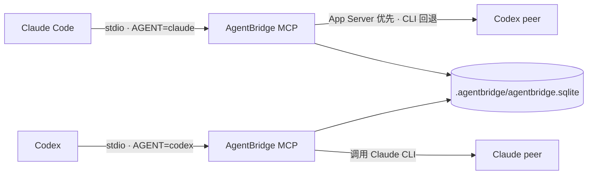

# AgentBridge

[**简体中文**](README.md) | [English](README.en.md) | [Español](README.es.md) | [给 AI Agent 的部署手册](README.ai.md)

AgentBridge 是一个本地优先的 MCP 协作核心，让 Claude Code 和 Codex 能在同一个项目中互相提问、回复、重试、达成一致，并把讨论状态保存在项目本地的 SQLite 数据库中。

> 当前开发版本：v0.8.0。本项目以 GitHub Release 分发本地 stdio MCP；便携包自带 Node.js 运行时，不要求用户另外安装 Node 或 npm。Release 安装后程序独立位于用户目录，不依赖下载目录或源码仓库。

> 当前源码验证状态：UTF-8 校验、TypeScript 构建以及完整自动化测试均已通过，其中 Release MCP 使用官方 SDK 连续完成 30 次握手。`auto/reuse` 会通过同一项目的 collaboration session 复用 Provider 原生会话；`fresh` 会建立隔离 room，并在该 room 内复用自己的 Provider 会话。上述自动化测试不等同于真实 Provider 端到端验收；只有 Claude → Codex 和 Codex → Claude 两个方向都完成实际 `ask_peer` 调用，才能声明真实双向通信可用。

> 如果你准备把本项目交给 Claude、Codex 或其他 AI Agent 自动部署，请优先让它完整阅读 [README.ai.md](README.ai.md)。该手册要求 Agent 明确判断当前连接的是 Codex App 的 App Server 还是独立 Codex CLI，并完成 doctor、配置文件、MCP 工具、真实双向调用四层验收。

> 许可提醒：v0.5.0 起采用 `PolyForm-Noncommercial-1.0.0`，公开许可只允许非商业用途；商业使用需要 HeadStone1 的单独书面授权。v0.4.2 及更早已发布版本继续适用当时的 Apache-2.0，详见 [许可历史](LICENSE_HISTORY.md)。因此 v0.5.0 起应称为“源码可用（source-available）”，不应称为 OSI 开源软件。

## 使用方法（先看这里）

### v0.6 系列最重要的变化：只需全局注册一次

安装后只运行一次 `agentbridge setup`。它会在 `~/.claude.json` 和 `~/.codex/config.toml` 中各写入一个全局 AgentBridge MCP 条目，不固定项目路径、数据库路径或 Codex `cwd`。以后打开项目 A、项目 B 或新项目时，不需要再次 setup。

Claude Code/Codex 第一次调用 AgentBridge 工具时，服务会依次使用显式兼容路径、`CLAUDE_PROJECT_DIR`、MCP `roots/list`、客户端启动目录识别当前项目，并在 `<当前项目>/.agentbridge/agentbridge.sqlite` 建立独立数据库。一个 MCP 进程只绑定一个项目，防止切换工作区后串库。如果客户端没有提供可靠项目上下文，AgentBridge 会明确报错且不会在用户目录建库；让 Agent 在第一次 `ask_peer` 或 `list_discussions` 中传入绝对 `projectPath` 即可。

最短安装与验证命令：

```bash
npm install --global @headstone/agentbridge
agentbridge setup
agentbridge doctor
```

从 v0.5.x 升级时，安装最新版后执行一次 `agentbridge setup`。它会把已登记的项目级 Claude/Codex 条目迁移为全局条目，保留其他 MCP 配置和各项目已有数据库。然后彻底退出并重启 Claude Code 与 ChatGPT/Codex。

### 1. 先选择安装方式

| 你的情况 | 应选择 | 是否需要 Node.js |
|---|---|---|
| 普通用户、Codex App 用户、希望开箱即用 | **GitHub Release 便携包（推荐）** | 不需要，包内自带运行时 |
| 已经使用 Node.js `22.13+` 的开发者 | npm 全局安装 | 需要 |
| 要修改 AgentBridge 源码或参与开发 | 源码安装 | 需要 Node.js、npm 和 Git |

三种方式只需选择一种。不要把 Release、npm 和源码命令混用。普通用户直接从 [AgentBridge Releases](https://github.com/HeadStone1/AgentBridge/releases/latest) 下载即可。

### 2. 安装前必须满足

- Claude Code 和 Codex 必须与 AgentBridge 安装在**同一台机器或同一个虚拟机**中，并且都能访问目标项目目录。宿主机安装的 Codex App 不能直接为虚拟机内的 AgentBridge 提供本地 App Server。
- 先安装并登录 Claude Code。AgentBridge 当前对接的是 Claude Code，不是只有聊天界面的 Claude Desktop。
- Codex 只需满足下面任意一种：
  - 已安装并登录 **Codex App**；**不要求另外安装 Codex CLI**。
  - 已安装并登录 Codex CLI，供没有 Codex App 的服务器或虚拟机使用。
- 使用 Codex App 时，建议先正常打开并完成一次登录。AgentBridge 会发现 App 自带的 Codex 可执行文件并启动受控的 `app-server` 子进程，不会接管已经打开的 GUI 进程。
- 每个要使用 AgentBridge 的项目都必须拥有本地读写权限。项目路径必须真实存在，建议始终使用绝对路径。

### 3. GitHub Release 安装（推荐）

#### Windows 10/11 x64

1. 从 [最新 Release](https://github.com/HeadStone1/AgentBridge/releases/latest) 下载以下两个文件：

   - `AgentBridge-v0.7.1-win32-x64.zip`
   - `SHA256SUMS.txt`

2. 在下载目录校验压缩包。下面命令在哈希不一致时会直接报错：

```powershell
$asset = 'AgentBridge-v0.7.1-win32-x64.zip'
$line = Get-Content -LiteralPath '.\SHA256SUMS.txt' |
  Where-Object { $_ -match "\s+$([regex]::Escape($asset))$" }
if (-not $line) { throw "SHA256SUMS.txt 中找不到 $asset" }
$expected = (($line -split '\s+')[0]).ToLowerInvariant()
$actual = (Get-FileHash -LiteralPath ".\$asset" -Algorithm SHA256).Hash.ToLowerInvariant()
if ($actual -ne $expected) { throw "SHA-256 校验失败，禁止安装" }
"SHA-256 verified: $asset"
```

3. 解压 ZIP，进入解压后的 `AgentBridge-v0.7.1-win32-x64` 目录，然后执行一次全局安装：

```powershell
Unblock-File -LiteralPath '.\install.ps1'
powershell -ExecutionPolicy Bypass -File .\install.ps1
```

`Test-Path` 必须返回 `True`。安装完成时，最后应看到类似输出：

```text
AgentBridge 0.7.1 installed in C:\Users\<用户名>\.agentbridge
Launcher: C:\Users\<用户名>\.agentbridge\bin\agentbridge.cmd
Full uninstall: & "C:\Users\<用户名>\.agentbridge\bin\agentbridge.cmd" uninstall-all --yes --remove-program
AgentBridge is registered globally. Restart Claude Code and Codex, then open any project.
```

在这些提示之前会依次输出 `setup` 和 `doctor` 的 JSON。`setup.configured` 应列出 Claude 和 Codex 两项配置结果；`changed: false` 只表示配置已经是最新状态，不是失败。`doctor.ok: false` 表示仍有环境或登录项要处理，按 `recommendations` 修复后重跑即可；只有 doctor 命令本身无法启动时安装脚本才会失败。

4. 运行诊断：

```powershell
$ab = "$env:USERPROFILE\.agentbridge\bin\agentbridge.cmd"
& $ab version
& $ab doctor
```

常见 Windows 错误：

- `Resolve-Path` 或“找不到路径”：项目目录不存在或路径写错；先让 `Test-Path` 返回 `True`。
- 脚本被阻止：确认压缩包来自本项目 Release 且 SHA-256 已通过，然后运行上面的 `Unblock-File` 和 `-ExecutionPolicy Bypass`。
- `Access denied`：默认安装到当前用户的 `%USERPROFILE%\.agentbridge`，通常不需要管理员权限；检查安全软件的“受控文件夹访问”以及当前用户是否能写入自己的用户目录。
- 找不到 launcher：确认 `%USERPROFILE%\.agentbridge\current` 和 `%USERPROFILE%\.agentbridge\bin\agentbridge.cmd` 均存在，不要从解压目录直接移动安装后的内部文件。

#### Linux x64 / macOS Apple Silicon

先确认系统与架构：

```bash
uname -s
uname -m
```

| 输出 | 下载文件 |
|---|---|
| `Linux` + `x86_64` | `AgentBridge-v0.7.1-linux-x64.tar.gz` |
| `Darwin` + `arm64` | `AgentBridge-v0.7.1-darwin-arm64.tar.gz` |

当前 Release 不提供 Linux ARM64 或 Intel Mac x64 便携包；这些平台请使用 npm 或源码安装。

下载对应压缩包和 `SHA256SUMS.txt` 后校验。Linux 示例：

```bash
asset='AgentBridge-v0.7.1-linux-x64.tar.gz'
grep "  $asset$" SHA256SUMS.txt | sha256sum -c -
```

macOS 示例：

```bash
asset='AgentBridge-v0.7.1-darwin-arm64.tar.gz'
expected=$(awk -v file="$asset" '$2 == file {print $1}' SHA256SUMS.txt)
actual=$(shasum -a 256 "$asset" | awk '{print $1}')
test -n "$expected" && test "$actual" = "$expected" || { echo 'SHA-256 校验失败，禁止安装' >&2; exit 1; }
echo "SHA-256 verified: $asset"
```

解压、补充执行权限并安装：

```bash
tar -xzf "$asset"
cd "${asset%.tar.gz}"
chmod +x install.sh
./install.sh
~/.agentbridge/bin/agentbridge version
~/.agentbridge/bin/agentbridge doctor
```

压缩包通常已经保留执行权限；如果出现 `Permission denied`，重新执行 `chmod +x install.sh`。安装脚本会依次运行全局 `setup` 和 `doctor`；完成时应看到 `AgentBridge 0.7.1 installed in ...`、`Launcher: ...`、`Full uninstall: ...` 和重启提示。

### 4. npm 安装（已有 Node.js 的开发者）

npm 包名为 [`@headstone/agentbridge`](https://www.npmjs.com/package/@headstone/agentbridge)，要求 Node.js `22.13` 或更高版本。建议全局安装，不建议使用一次性的 `npx` 执行 `setup`，因为 MCP 配置需要稳定的程序路径。

```bash
node --version
npm install --global @headstone/agentbridge
agentbridge --version
agentbridge setup
agentbridge doctor
```

升级 npm 安装版本：

```bash
npm install --global @headstone/agentbridge@latest
agentbridge setup
```

npm 安装不携带 Node 运行时。不想自行管理 Node/npm 时使用 GitHub Release 便携包。

### 5. 源码安装（仅用于开发）

```bash
git clone https://github.com/HeadStone1/AgentBridge.git
cd AgentBridge
npm ci
npm test
node packages/cli/dist/index.js setup
node packages/cli/dist/index.js doctor
```

`npm test` 会先构建全部 workspace，再运行单元和集成测试。源码安装的详细开发流程见后文“开发与发布”。

### 6. 只安装 Codex App、没有 Codex CLI

这是受支持的正常用法，不需要为了 AgentBridge 再全局安装 Codex CLI。运行 `doctor` 后重点检查：

```json
{
  "providers": {
    "codexAppServer": true,
    "codexSelectedBackend": {
      "mode": "app-server",
      "source": "desktop"
    }
  }
}
```

- `mode: "app-server"` 表示实际选择了 App Server 协议。
- `source: "desktop"` 表示发现的是 Codex App 自带运行文件。
- `codexAppDetected` 只表示 GUI 进程是否正在运行，是诊断信息，不是可用性的判定条件。
- 没有独立 PATH 安装的 Codex CLI 时，不能把 `codex --version` 是否成功当成唯一验收标准；以 `codexSelectedBackend` 和后面的真实 MCP 调用为准。
- 如果显示 `source: "system"` 或 `mode: "cli"`，说明当前实际走的是系统 CLI，而不是 Codex App 后端。

### 7. 全局注册与多项目隔离

安装时执行一次 `setup` 即可。Claude 的全局条目位于 `~/.claude.json`，Codex App、CLI 和 IDE 共用的全局条目位于 `~/.codex/config.toml`。配置中只保存启动命令和 `AGENTBRIDGE_AGENT` 身份，不保存固定项目路径、数据库路径或 `cwd`。

每个客户端项目会启动或绑定自己的 stdio MCP 进程。首次工具调用自动创建该项目的 `.agentbridge/project.json` 和 `.agentbridge/agentbridge.sqlite`，因此项目 A 与项目 B 的讨论仍然物理隔离。切换到另一个项目时请打开新的客户端任务/窗口；一个已经绑定的 MCP 进程不会在运行中改绑，以免串库。

配置后完全退出并重新启动 Claude Code 和 Codex App；仅关闭项目窗口不一定会重新加载 MCP。从 v0.5.x 升级也只需重新执行一次无参数 `agentbridge setup`。

### 配置自主调用与讨论生命周期

AgentBridge 的运行时配置分为“全局默认”和“项目覆盖”两层，不需要再为每个项目手工设置环境变量：

- 全局配置：`~/.agentbridge/config.json`；可通过 `AGENTBRIDGE_CONFIG_HOME` 更换配置根目录。
- 项目配置：`<项目>/.agentbridge/config.json`；可以提交到 Git，与团队共享项目规则。
- 生效优先级：程序默认值 < 全局配置 < 项目配置 < 兼容性的 `AGENTBRIDGE_*` 环境变量。
- 没有写入项目配置的字段会继承全局值；项目配置只需要保存差异。

直接在项目目录运行下面的命令，会打开一次性的本地配置页面（监听 `127.0.0.1`；关闭页面或空闲超时后退出）：

```bash
agentbridge ui
```

页面可以分别编辑全局默认、当前项目覆盖，并显示最终生效值及其来源。Release 用户和源码用户分别替换为自己的 launcher 或 `node packages/cli/dist/index.js ui` 即可。项目路径未指定时会使用当前工作目录；从用户根目录、磁盘根目录或安装目录启动时不会把这些目录误当成项目。

最小配置示例：

```json
{
  "version": 1,
  "invocation": {
    "autonomous": true
  },
  "discussion": {
    "maxDuration": "2h",
    "idleTimeout": "10m",
    "turnHardLimit": "1h",
    "maxTurns": 20
  },
  "session": {
    "retentionDays": 30,
    "archiveOnClose": false
  }
}
```

`invocation.autonomous` 默认是 `true`，允许 Agent 在判断需要跨模型协作时自主调用 `ask_peer`。设置为 `false` 后，MCP 只接受明确由用户发起的调用；调用方需要把 `ask_peer.invocationOrigin` 标记为 `user_requested`，标记为 `autonomous` 的调用会被拒绝。Skill 只描述讨论流程和质量要求，不能绕过这项配置。

生命周期字段支持 `ms`、`s`、`m`、`h`、`d`：

- `discussion.maxDuration`：整场讨论的最长墙钟时间，支持 `null` 表示不设置整体时限。
- `discussion.idleTimeout`：讨论在无新消息时的静默超时。
- `discussion.startupTimeout`、`stallGrace`、`turnHardLimit`、`leaseTimeout`、`terminationGrace`：启动、卡顿、单轮、租约和终止宽限控制。
- `discussion.maxTurns`：1–50 的安全上限，不代表必须完成这么多轮。

即使将 `maxDuration` 设为 `null`，静默、单轮、provider 和进程级安全控制仍然生效。完整字段、校验范围、备份行为及环境变量兼容映射见 [配置说明](docs/CONFIGURATION.md)。

### 8. 分四层验证安装结果

`doctor` 会检查安装模式、Node、项目元数据、项目登记、数据库读写、Claude/Codex MCP 配置、启动命令和 provider 后端。单项失败会写入 JSON 的 `recommendations`，不会因项目未初始化或 provider 不可用而中途崩溃，也不会为了检查而创建不存在的项目。它仍然**不能证明已经打开的 Claude Code 或 Codex App 已重新加载 MCP 配置**，因此请依次完成下面四层验证。

#### 第一层：运行环境

```powershell
& "$env:USERPROFILE\.agentbridge\bin\agentbridge.cmd" doctor 'C:\你的项目目录'
```

Linux/macOS 或 npm 安装时使用对应的 `agentbridge doctor` 命令。重点检查：

- 顶层 `ok` 为 `true`；若为 `false`，按 `recommendations` 从上到下处理后重跑。
- `node.ok` 和 `installation.valid` 为 `true`；Release/npm 用户还应确认 `installation.sourceIndependent` 为 `true`，源码开发模式为 `false` 是预期结果。
- `project.initialized`、`project.metadataValid` 和 `registry.registered` 为 `true`。
- `database.ok`、`configuration.claude.ok`、`configuration.codex.ok` 为 `true`。
- `providers.claudeCli` 为 `true`。
- Codex App 用户检查 `codexSelectedBackend.mode=app-server`、`source=desktop`。
- Codex CLI 用户检查 `codexSelectedBackend.mode=cli`，并确认选择的是预期命令。

#### 第二层：配置文件确实写入

Windows：

```powershell
Select-String -LiteralPath "$env:USERPROFILE\.claude.json" -Pattern 'agentbridge'
Select-String -LiteralPath "$env:USERPROFILE\.codex\config.toml" -Pattern 'mcp_servers.agentbridge|AGENTBRIDGE_AGENT|AGENTBRIDGE_PROJECT_PATH|AGENTBRIDGE_DB_PATH|cwd'
```

Linux/macOS：

```bash
grep -n 'agentbridge' ~/.claude.json
grep -nE 'mcp_servers.agentbridge|AGENTBRIDGE_AGENT|AGENTBRIDGE_PROJECT_PATH|AGENTBRIDGE_DB_PATH|cwd' ~/.codex/config.toml
```

Claude 条目应位于用户级 `mcpServers.agentbridge`；Codex 条目应位于用户级 `[mcp_servers.agentbridge]`。Claude 身份为 `claude`，Codex 身份为 `codex`；两边都不应固定 `AGENTBRIDGE_PROJECT_PATH`、`AGENTBRIDGE_DB_PATH` 或 `cwd`。

#### 第三层：两个客户端已经加载 MCP

1. 完全退出并重新打开 Claude Code 和 Codex App/CLI，然后在两边打开同一个项目。
2. 在各客户端的 MCP/工具列表中确认服务器名 `agentbridge` 已加载。客户端版本不同，入口可能显示为 MCP、Tools 或 Integrations。
3. 应能看到八个工具：`ask_peer`、`reply_peer`、`get_discussion`、`wait_discussion`、`list_discussions`、`close_discussion`、`cancel_discussion`、`retry_discussion`。
4. 如果配置文件正确但工具没有出现，查看客户端自己的 MCP 启动错误；`doctor` 无法代替这一检查。

#### 第四层：真实双向调用

先在 Claude Code 中执行：

```text
请使用 AgentBridge 的 ask_peer 工具询问 Codex：检查当前项目 README，并概括项目用途。
```

再在 Codex 中执行相反方向的请求：

```text
请使用 AgentBridge 的 ask_peer 工具询问 Claude：检查当前项目 README，并指出一项可以改进的地方。
```

最后检查讨论是否已保存：

```powershell
& "$env:USERPROFILE\.agentbridge\bin\agentbridge.cmd" status 'C:\你的项目目录'
```

Linux/macOS 或 npm 安装使用 `agentbridge status /absolute/path/to/your-project`。只有两个方向的真实工具调用都成功，才能确认端到端联通。

### 9. 检查更新、安装更新和回滚

Windows：

```powershell
$ab = "$env:USERPROFILE\.agentbridge\bin\agentbridge.cmd"
& $ab version
& $ab update
& $ab update --install
& $ab rollback
```

Linux/macOS：

```bash
~/.agentbridge/bin/agentbridge version
~/.agentbridge/bin/agentbridge update
~/.agentbridge/bin/agentbridge update --install
~/.agentbridge/bin/agentbridge rollback
```

`update` 只检查，不修改文件；只有 `update --install` 才会下载对应平台的 Release 包，校验 `SHA256SUMS.txt` 后安装。程序按版本保存在 `~/.agentbridge/versions/`，项目中的配置和 SQLite 数据不会被覆盖。`rollback` 只切换到已经安装的上一版本。

升级后重新运行 `setup` 可以确认 Claude/Codex 配置仍指向当前安装位置。

### 10. 项目卸载和一键完整卸载

删除某一个项目的数据时执行：

```powershell
& "$env:USERPROFILE\.agentbridge\bin\agentbridge.cmd" uninstall 'C:\你的项目目录' --yes
```

或 npm/Unix：

```bash
agentbridge uninstall /absolute/path/to/your-project --yes
```

该命令只会：

- 删除当前项目的 `.agentbridge` 运行数据和讨论数据库，但保留 `.agentbridge/config.json` 项目配置。
- 从自动清理登记中移除该项目。
- 保留全局 Claude/Codex MCP 条目、其他项目、其他 MCP 服务以及 AgentBridge 程序本身。

它**不会删除** Release 安装目录 `%USERPROFILE%\.agentbridge` 或 `~/.agentbridge`，也不会卸载 npm 全局包。需要保留讨论记录时，先备份项目的 `.agentbridge` 目录；项目配置会被自动保留。Windows、Linux、macOS 使用相同语义。

要删除所有已登记项目的 AgentBridge 配置、讨论数据和程序本身，使用一键完整卸载。该命令需要两个明确确认参数，避免误操作。

Windows Release 安装：

```powershell
& "$env:USERPROFILE\.agentbridge\bin\agentbridge.cmd" uninstall-all --yes --remove-program
```

Linux/macOS Release 安装：

```bash
~/.agentbridge/bin/agentbridge uninstall-all --yes --remove-program
```

npm 安装：

```bash
agentbridge uninstall-all --yes --remove-program
```

完整卸载会读取 `~/.agentbridge/projects.json`，并兼容发现旧版本已写入 `~/.claude.json` 的 AgentBridge 项目；先删除各项目 `.agentbridge` 数据和全局/旧版 MCP 条目，再卸载程序。若任一项目清理失败，程序文件会保留，方便修复权限后重试。源码开发模式不会自动删除 Git 仓库；请先运行 `uninstall-all --yes` 清配置和数据，再自行决定是否删除源码目录。

可以在 Claude Code 或 Codex 编码任务中要求代理运行上述命令，但它仍必须获得你的命令执行授权。AgentBridge 不提供可被普通 MCP 调用直接触发的自毁工具。Windows Release 完整卸载会在后台等待 AgentBridge 进程退出；执行命令后请完全退出 Claude Code 与 Codex，程序目录随后会被删除。Linux/macOS 可在当前命令退出后删除已打开的程序文件。

## 目录

- [它如何工作](#它如何工作)
- [使用方法（先看这里）](#使用方法先看这里)
- [给 AI Agent 的部署手册](README.ai.md)
- [English README](README.en.md)
- [README en español](README.es.md)
- [当前功能与边界](#当前功能与边界)
- [虚拟机源码开发快速开始](#虚拟机源码开发快速开始)
- [配置 Claude 和 Codex](#配置-claude-和-codex)
- [配置自主调用与讨论生命周期](#配置自主调用与讨论生命周期)
- [首次真实联通测试](#首次真实联通测试)
- [MCP 工具说明](#mcp-工具说明)
- [讨论状态说明](#讨论状态说明)
- [管理命令](#管理命令)
- [环境变量](#环境变量)
- [更新到最新版](#更新到最新版)
- [备份、恢复与卸载](#备份恢复与卸载)
- [常见问题](#常见问题)
- [开发与发布](#开发与发布)
- [安全说明](#安全说明)

## 它如何工作

Claude Code 和 Codex 各自启动一个短生命周期的 stdio MCP 进程。两个 MCP 进程共享项目中的 SQLite 数据库，但各自代表不同的代理身份。



AgentBridge 不会把代码或讨论上传到自己的云服务。实际模型请求仍由本机安装并已登录的 Claude/Codex 客户端发送给各自的服务商。

## 当前功能与边界

已实现：

- 使用 Node 内置 `node:sqlite` 的 SQLite WAL 存储。
- 双 MCP 进程共享讨论、消息、决定、审计事件、会话租约和 provider 原生会话 ID。
- `ask_peer`、`reply_peer`、`get_discussion`、`wait_discussion`、`list_discussions`、`close_discussion`、`cancel_discussion`、`retry_discussion` 八个 MCP 工具。
- Claude CLI、Codex CLI 和 Codex App Server 的会话 ID 通过项目级 collaboration session 持久化；`auto/reuse` 可跨同项目 discussion 续接 AgentBridge 所有的会话，`fresh` 保持隔离；续接失败时使用 SQLite 历史重建有界上下文。
- 自动发现 Codex Desktop 或新版 ChatGPT Desktop 自带的 Codex 运行程序，优先使用 App Server stdio 协议。
- App Server 不可用时自动回退到 Codex CLI `exec --json` 和 `exec resume`。
- 讨论轮数、重试次数、总消息长度和持续时间限制。
- 全局/项目两级 JSON 配置、配置来源追踪，以及用完即走的 `agentbridge ui` 配置页面。
- `init`、`setup`、`ui`、`doctor`、`status`、`register-session`、`version`、`update`、`rollback`、项目 `uninstall` 和系统级 `uninstall-all` 管理命令。
- 增量修改 Claude JSON 与 Codex TOML 配置，修改前生成备份。
- 并发 SQLite 启动锁等待与双进程回归测试。

当前边界：

- 必须在运行 AgentBridge 的系统或虚拟机内安装并登录 Claude/Codex；宿主机登录状态不会自动进入虚拟机。
- Codex App Server 适配器会启动一个新的受控子进程，不会接管已打开的 Codex Desktop 私有进程。
- `agentbridge ui` 只启动一次性的本地 HTTP 配置页面；没有常驻 Web 服务、PostgreSQL/Redis、严格模式或等待队列。
- 正在执行中的 provider 请求仍无法在进程崩溃后原地恢复；代码签名、静默后台更新和云端部署仍是后续工作。
- 是否能完成真实调用最终取决于本机 provider 版本、账号权限、网络和模型配额。

## 虚拟机源码开发快速开始

本节只适用于需要从源码构建 AgentBridge 的开发者。只想在虚拟机中使用 AgentBridge 时，优先按 README 顶部选择 Release 或 npm 安装。以下命令以 Linux/bash 为主；PowerShell 可执行同样的 `git`、`npm` 和 `node` 命令，只需把路径换成 Windows 路径。

### 1. 检查必需软件

```bash
git --version
node --version
npm --version
claude --version
# 仅 Codex CLI 用户需要：
codex --version
```

要求：

- Node.js `22.13` 或更高版本。
- Git。
- Claude 侧需要可调用的 Claude CLI；Codex 侧可以只安装 Codex Desktop，也可以安装 Codex CLI。
- Claude/Codex 已在虚拟机内完成登录，并能各自单独执行一次普通请求。

GUI 用户不要求手工把 Codex 加入 `PATH`。新版 ChatGPT Desktop 的 MSIX 包内 runtime 不允许包外程序直接执行，因此 AgentBridge v0.7.1 随 npm/便携包安装官方 `@openai/codex` CLI，并优先用它启动独立 stdio App Server；同时兼容旧 Codex Desktop 的 `%LOCALAPPDATA%\OpenAI\Codex\bin\codex.exe` 及其版本化运行文件，最后才尝试 PATH 中的 `codex`。ChatGPT Desktop 登录不保证独立 CLI 已登录；若 `codex login status` 未登录，在同一 Windows 用户下执行一次 `codex login`。

如果 `node --version` 低于 `v22.13.0`，先升级 Node。Node 22.5–22.12 的 `node:sqlite` 默认仍需要实验开关，不在本项目支持范围内。

### 2. 获取或更新代码

首次下载：

```bash
git clone --branch main --single-branch https://github.com/HeadStone1/AgentBridge.git
cd AgentBridge
```

已经克隆过：

```bash
cd AgentBridge
git pull --ff-only origin main
```

确认版本：

```bash
git log -1 --oneline
```

### 3. 安装依赖并构建

```bash
npm ci
npm test
```

`npm test` 会先完成构建，再运行全部测试。测试成功时应看到所有测试通过；构建产物位于各 package 的 `dist/` 目录。

### 4. 全局配置

源码模式也只需运行一次：

```bash
node packages/cli/dist/index.js setup
node packages/cli/dist/index.js doctor
```

`setup` 会增量更新用户级 `~/.claude.json` 和 `~/.codex/config.toml`，修改前创建 `*.agentbridge.bak`，并保留其他 MCP 服务。两个条目使用同一入口，但身份分别为 `AGENTBRIDGE_AGENT=claude` 和 `AGENTBRIDGE_AGENT=codex`。

全局条目不能包含固定的 `AGENTBRIDGE_PROJECT_PATH`、`AGENTBRIDGE_DB_PATH` 或 Codex `cwd`。项目路径在 MCP 运行时识别，数据库始终位于识别出的 `<项目>/.agentbridge/agentbridge.sqlite`。

如果使用自定义配置位置：

```bash
node packages/cli/dist/index.js setup \
  --claude-config /path/to/claude.json \
  --codex-config /path/to/codex/config.toml
```

### 5. 运行诊断

```bash
node packages/cli/dist/index.js doctor
node packages/cli/dist/index.js status /absolute/path/to/project
```

重点检查 `doctor`：`configuration.claude.scope` 和 `configuration.codex.scope` 应为 `global`，两端 `dynamicRouting` 应为 `true`；`providers.codexSelectedBackend.mode` 默认优先为 `app-server`，`source: desktop` 表示发现 Codex App 自带后端。尚未调用过工具的项目没有 `.agentbridge` 属于正常状态，doctor 会显示 `autoInitialize: true`，不要求为每个项目 setup。

相关用户级配置和 MCP roots 能力见 [Claude Code MCP 文档](https://code.claude.com/docs/en/mcp) 与 [OpenAI Codex MCP 文档](https://learn.chatgpt.com/docs/extend/mcp?surface=cli)。

### Codex GUI 优先与 App Server

默认策略为 `auto`，无需提供 Codex CLI 路径：

1. 先检查显式环境变量。
2. 自动查找 Codex Desktop 自带的可执行程序。
3. 对每个候选程序运行 `app-server --help` 能力探测。
4. 优先启动独立的 stdio App Server；不支持时才回退到 `codex exec`。

App Server 是 OpenAI 为富客户端集成提供的公开协议，stdio 是默认传输。参见 [OpenAI Codex App Server 文档](https://learn.chatgpt.com/docs/app-server)。

一般用户只需运行：

```bash
node packages/cli/dist/index.js setup
node packages/cli/dist/index.js doctor
```

如果自动发现失败，可以显式指定支持 App Server 的可执行程序：

```bash
node packages/cli/dist/index.js setup \
  --codex-app-command /absolute/path/to/codex-executable
```

也可以设置：

```bash
export AGENTBRIDGE_CODEX_APP_COMMAND=/absolute/path/to/codex-executable
```

也可以强制后端模式：

```bash
# 只允许 App Server，探测失败时直接报错
node packages/cli/dist/index.js setup --codex-mode app-server

# 强制使用传统 CLI 通道
node packages/cli/dist/index.js setup --codex-mode cli \
  --codex-command /absolute/path/to/codex
```

GUI 优先不等于接管当前窗口。AgentBridge 会复用 GUI 安装中公开的 Codex 运行程序和登录配置，但会启动新的受控 App Server 子进程；它不会连接到已经打开的 Codex Desktop 私有会话，也不会读取当前 GUI 对话。

## 首次真实联通测试

完成配置后，完全退出并重新启动 Claude Code 和 Codex，使 MCP 配置重新加载。

### 从 Claude 发起

在 Claude Code 中输入类似请求：

```text
请使用 AgentBridge 的 ask_peer 工具询问 Codex：
检查当前项目的 README，并用一句话回复是否能正常读取项目。
```

Claude 调用的工具参数应类似：

```json
{
  "peer": "codex",
  "message": "检查当前项目的 README，并用一句话回复是否能正常读取项目。",
  "projectPath": "/absolute/path/to/AgentBridge"
}
```

成功响应通常包含：

- `discussionId`，例如 `dsc_...`。
- `messageId`。
- `status: "DISCUSSING"`。
- provider 可用时的 `peerResponse`。

### 从 Codex 发起

在 Codex 中输入：

```text
请使用 AgentBridge 的 ask_peer 工具询问 Claude：
总结 package.json 中提供的 npm scripts。
```

Codex 侧 `peer` 必须是 `claude`。

### 检查持久化结果

```bash
node packages/cli/dist/index.js status .
```

也可以让任一代理调用：

```json
{
  "name": "list_discussions",
  "arguments": {
    "projectPath": "/absolute/path/to/AgentBridge"
  }
}
```

如果真实调用失败，讨论记录仍可能保存为 `PEER_BUSY`、`FAILED` 或 `TIMEOUT`，可通过 `status` 或 `get_discussion` 查看。

## MCP 工具说明

### `ask_peer`

开始一场新讨论，并调用另一代理。

```json
{
  "peer": "codex",
  "message": "请审查这个实现方案。",
  "projectPath": "/project/path",
  "mode": "review"
}
```

- Claude 侧只能选择 `codex`。
- Codex 侧只能选择 `claude`。
- `projectPath` 可省略，默认使用 MCP 进程当前工作目录。
- 返回的 `discussionId` 用于后续所有操作。
- `mode` 可选：`review`、`discussion`、`deep-discussion`。`review` 是一次独立评审；`discussion` 和 `deep-discussion` 会在两个 Provider 间自动交替，达成共识后立即进行结论 hash 双签；安全上限分别为 3、12、20，不是必须完成的次数。
- 自动模式要求 Claude 和 Codex 两个 connector 都已配置；缺少任意一个时会明确返回 `UNAVAILABLE`，不会静默降级为单轮回答。
- `ask_peer` 固定同步执行：`review` 等待本次对端回复，自动模式等待整场讨论到完成、需要用户决策或已记录失败后才返回，不再转入后台并返回中间 `WAIT`。
- `maxTurns` 可选，范围 1–50；它覆盖模式默认值，只是安全上限，不是必须聊满的目标。
- `get_discussion` 会返回持久化的 `mode`、`maxTurns` 和最新 `lastSignal`；对端明确返回 `NEEDS_USER_DECISION` 时讨论会暂停交给用户决策。

### `reply_peer`

继续手动/review 讨论，并把回复发送给另一参与者；自动讨论运行期间不能插入回复，暂停后可用它提交用户决定并恢复讨论。

```json
{
  "discussionId": "dsc_xxxxxxxxxxxx",
  "message": "我接受第一点，但建议修改超时策略。"
}
```

发送者由当前 MCP 宿主身份决定，不需要在参数中指定。

### `get_discussion`

读取讨论详情、全部消息以及最终决定。

```json
{
  "discussionId": "dsc_xxxxxxxxxxxx"
}
```

### `wait_discussion`

兼容性观察工具，用于读取已有 discussion 的后续状态；正常的同步 `ask_peer` / `reply_peer` 流程不需要调用它，等待超时也不会改变讨论状态：

```json
{
  "discussionId": "dsc_xxxxxxxxxxxx",
  "timeoutMs": 30000,
  "afterMessageId": "msg_xxxxxxxxxxxx"
}
```

同一问题必须复用原 `discussionId`；不要为了读取状态再次调用 `ask_peer`。`setup` 会为 Claude Code 和 Codex 安全安装四项轻量 Skill：核心协作 Skill 可自动路由，三个专项 Skill 仅在明确调用时启用；同名自定义或已修改 Skill 不会被覆盖。

### `list_discussions`

列出讨论。可按项目路径过滤：

```json
{
  "projectPath": "/project/path"
}
```

不传 `projectPath` 时会列出当前数据库中的全部讨论。

### `close_discussion`

记录当前代理对结论的接受，并自动请求对端确认：

```json
{
  "discussionId": "dsc_xxxxxxxxxxxx",
  "conclusion": "采用 WAL，并在申请写锁前设置有界等待。"
}
```

重要规则：

- AgentBridge 会把规范结论和 decision hash 发送给对端，要求对端返回结构化的接受或拒绝结果。
- 对端接受同一 hash 时自动记录第二份 agreement，进入 `COMPLETED` 并生成决定记录。
- 对端接受同一 hash 时自动完成；拒绝确认时会根据 `resolution` 区分继续讨论或进入 `NEEDS_USER_DECISION`。无法统一的目标、风险或偏好会保留双方观点并交给用户决策。
- 对端临时不可用、回复格式无效或需要重试时保持可恢复状态，调用方可以在同一讨论上继续或重试。
- 自动确认不可用时仍兼容手工双签：另一个代理可使用相同 `discussionId` 和完全相同的 `conclusion` 调用一次 `close_discussion`。

讨论消息始终完整保存在 SQLite 中。发送给新 provider 会话的恢复上下文采用“首条提案 + 尽可能多的最近消息”，默认历史字符预算为 48,000，并对单条历史消息截断；成功续接 provider 原生会话时不会重复注入历史。

### `cancel_discussion`

取消讨论并释放本地会话租约：

```json
{
  "discussionId": "dsc_xxxxxxxxxxxx"
}
```

### `retry_discussion`

在 `FAILED`、`PEER_BUSY`、`TIMEOUT` 或 `NEEDS_USER_DECISION` 后，重新派发最后一条消息：

```json
{
  "discussionId": "dsc_xxxxxxxxxxxx"
}
```

失败重试会消耗重试预算。达到上限后，讨论进入 `NEEDS_USER_DECISION`。

## 讨论状态说明

| 状态 | 含义 | 常用后续操作 |
|---|---|---|
| `CREATED` | 已创建，尚未正式讨论 | 等待派发 |
| `DISCUSSING` | 正在讨论 | `reply_peer`、`close_discussion` |
| `AGREED` | 双方已同意，正在生成/完成决定 | 通常自动进入 `COMPLETED` |
| `IMPLEMENTING` | 预留的实现阶段 | 当前本地流程较少使用 |
| `REVIEWING` | 预留的审查阶段 | 当前本地流程较少使用 |
| `COMPLETED` | 已完成 | `get_discussion` |
| `FAILED` | provider 或处理失败 | `retry_discussion` |
| `PEER_BUSY` | 对端繁忙或不可用 | 检查 provider，再重试 |
| `TIMEOUT` | 超时或达到资源限制 | 检查原因，再重试或取消 |
| `NEEDS_USER_DECISION` | 存在无法自动统一的分歧，或自动恢复/重试预算已用尽 | 用户解决分歧、决定重试或取消 |
| `CANCELLED` | 已取消 | 只读查看历史 |

## 管理命令

Release 安装用户在 Windows 使用：

```powershell
& "$env:USERPROFILE\.agentbridge\bin\agentbridge.cmd" <command> [path] [options]
```

Linux/macOS 使用：

```bash
~/.agentbridge/bin/agentbridge <command> [path] [options]
```

从源码运行的开发者使用：

```bash
node packages/cli/dist/index.js <command> [path] [options]
```

| 命令 | 作用 |
|---|---|
| `init [path]` | 只创建 `.agentbridge/project.json` |
| `setup [path]` | 全局配置 MCP；可选 path 只用于预初始化一个项目 |
| `doctor [path]` | 分项检查安装、项目登记、配置、数据库、启动命令和 provider；返回修复建议 |
| `status [path]` | 显示会话、讨论和审计指标 |
| `cleanup [path] --older-than-days N [--yes]` | 预览或删除过期的已完成/已取消讨论；无 `--yes` 时只预览 |
| `register-session` | 手动登记 provider 原生会话 |
| `version` | 显示当前程序版本 |
| `update` | 从 GitHub Releases 检查稳定版更新，不安装 |
| `update --install` | 下载、校验并安装当前平台的最新稳定版 |
| `update --channel beta` | 检查包含预发布版本的更新通道 |
| `rollback` | 切换到本机已经安装的上一版本 |
| `ui [path]` | 打开一次性的全局/项目配置页面；默认使用当前项目目录 |
| `uninstall [path] --yes` | 删除该项目状态；保留全局 MCP 条目和程序目录 |
| `uninstall-all --yes` | 删除所有已登记项目状态及全局/旧版 MCP 条目；保留程序 |
| `uninstall-all --yes --remove-program` | 完整卸载所有项目和 Release/npm 程序；源码仓库不会自动删除 |

查看帮助：

```bash
node packages/cli/dist/index.js help
```

手动登记会话示例：

```bash
node packages/cli/dist/index.js register-session \
  --provider codex \
  --session-id SESSION_ID \
  --status IDLE \
  --project-path . \
  --metadata '{"source":"manual"}'
```

支持的会话状态为 `IDLE`、`BUSY`、`BRIDGE_OWNED`、`ARCHIVED` 和 `UNKNOWN`。

## 环境变量

| 变量 | 用途 | 默认值/说明 |
|---|---|---|
| `AGENTBRIDGE_AGENT` | 当前 MCP 身份 | `claude`；Codex 侧必须显式设置为 `codex` |
| `AGENTBRIDGE_CONFIG_HOME` | 全局/项目配置根目录 | `~/.agentbridge` |
| `AGENTBRIDGE_PROJECT_PATH` | 显式项目路径兼容覆盖 | 全局 setup 不写入；运行时优先于 `CLAUDE_PROJECT_DIR`、MCP roots 和 cwd |
| `AGENTBRIDGE_DB_PATH` | 旧版/测试数据库覆盖 | 全局模式不写入；数据库自动位于 `<项目>/.agentbridge/agentbridge.sqlite` |
| `AGENTBRIDGE_CLAUDE_COMMAND` | Claude CLI 命令或绝对路径 | `claude` |
| `AGENTBRIDGE_CODEX_MODE` | Codex 后端策略 | `auto`；也可设为 `app-server` 或 `cli` |
| `AGENTBRIDGE_CODEX_COMMAND` | Codex 可执行程序覆盖路径 | 未设置时自动发现 Desktop，再尝试 PATH |
| `CODEX_CLI_PATH` | Codex CLI 备用路径 | 无 |
| `AGENTBRIDGE_CODEX_MODEL` | Codex CLI 模型覆盖 | 使用 Codex 默认模型 |
| `AGENTBRIDGE_CODEX_APP_COMMAND` | 仅用于 App Server 的可执行程序覆盖路径 | 未设置时自动发现 Desktop |
| `AGENTBRIDGE_RECOVERY_MAX_AGE_MS` | 旧讨论恢复阈值 | 默认 30 分钟 |
| `AGENTBRIDGE_MAX_TURNS` | 覆盖所有模式的实质性 Provider 回复安全上限 | 未设置时按模式取 3/12/20；协议确认不消耗上限，设置范围 1–50 |
| `AGENTBRIDGE_DISCUSSION_RETENTION_DAYS` | 启动时清理终态讨论 | 未设置或 `0` 表示永久保留；可选 1–3650 |
| `AGENTBRIDGE_ARCHIVE_SESSIONS_ON_CLOSE` | close/cancel 后尝试归档 Provider 原生会话 | 默认关闭；设为 `1` 启用，Provider 不支持时安全跳过 |
| `AGENTBRIDGE_AUTONOMOUS_INVOCATION` / `AGENTBRIDGE_ALLOW_AUTONOMOUS` | 兼容性覆盖自主调用开关 | `true`；JSON 配置优先级较低 |
| `AGENTBRIDGE_MAX_DURATION_MS` | 兼容性覆盖整场讨论最长时间 | 毫秒；设为 `0` 表示不限制整体时长 |
| `AGENTBRIDGE_IDLE_TIMEOUT_MS` | 兼容性覆盖静默超时 | 毫秒 |
| `AGENTBRIDGE_STARTUP_TIMEOUT_MS`、`AGENTBRIDGE_STALL_GRACE_MS` | 兼容性覆盖启动/卡顿控制 | 毫秒 |
| `AGENTBRIDGE_TURN_HARD_LIMIT_MS`、`AGENTBRIDGE_TIMEOUT_MS`、`AGENTBRIDGE_TERMINATION_GRACE_MS` | 兼容性覆盖单轮、租约/旧版超时和终止宽限 | 毫秒 |

不要把测试专用的 `AGENTBRIDGE_TEST_*` 变量用于生产配置。

## 更新到最新版

### Release 安装用户

检查新版不会修改本机：

```powershell
& "$env:USERPROFILE\.agentbridge\bin\agentbridge.cmd" update
```

确认后安装：

```powershell
& "$env:USERPROFILE\.agentbridge\bin\agentbridge.cmd" update --install
```

更新流程会：

1. 调用 `HeadStone1/AgentBridge` 的 GitHub Releases API。
2. 选择当前操作系统和 CPU 架构对应的包。
3. 下载 Release 包与 `SHA256SUMS.txt`。
4. 校验 SHA-256；缺少校验文件或校验失败时拒绝安装。
5. 安装到 `~/.agentbridge/versions/<版本>/`，再切换 `current` 版本指针。
6. 保留旧版本、项目 MCP 配置和项目 SQLite 数据。

安装成功后重启 Claude Code 和 Codex。需要回退时：

```powershell
& "$env:USERPROFILE\.agentbridge\bin\agentbridge.cmd" rollback
```

Linux/macOS 把命令入口替换为 `~/.agentbridge/bin/agentbridge`。

### 源码安装用户

在虚拟机或目标机器中执行：

```bash
cd AgentBridge
git status
git pull --ff-only origin main
npm install
npm test
npm run build
node packages/cli/dist/index.js setup
node packages/cli/dist/index.js doctor
```

如果 `git status` 显示有未提交修改，先确认这些修改是否需要保留。需要保留时：

```bash
git stash
git pull --ff-only origin main
git stash pop
```

不要在不了解本地修改用途时执行强制重置。

## 备份、恢复与卸载

### 配置备份

AgentBridge 修改已有配置前会创建：

- `~/.claude.json.agentbridge.bak`
- `~/.codex/config.toml.agentbridge.bak`

每次配置前建议另外复制一份带时间戳的备份，因为固定名称的 `.agentbridge.bak` 可能被后续操作覆盖。

Linux 恢复示例：

```bash
cp ~/.claude.json.agentbridge.bak ~/.claude.json
cp ~/.codex/config.toml.agentbridge.bak ~/.codex/config.toml
```

### 讨论数据备份

停止 Claude/Codex 后，复制整个 `.agentbridge` 目录：

```bash
cp -a .agentbridge .agentbridge.backup
```

数据库可能使用 `-wal` 和 `-shm` 文件，因此不要只复制主 `.sqlite` 文件，也不要在活跃写入期间直接复制。

### 卸载

```bash
node packages/cli/dist/index.js uninstall . --yes
```

该操作会：

- 从 Claude/Codex 配置中移除名为 `agentbridge` 的 MCP 条目。
- 保留其他 MCP 服务和 provider 配置。
- 删除当前项目的 `.agentbridge` 运行数据和讨论数据库，保留 `.agentbridge/config.json`。

卸载会删除本地讨论数据；项目配置不会被删除，需要保留讨论数据时仍应先执行备份。

这只是“项目卸载”：不会删除 Release 安装目录 `%USERPROFILE%\.agentbridge` / `~/.agentbridge`，也不会卸载 npm 全局包。完整卸载直接运行：

```bash
agentbridge uninstall-all --yes --remove-program
```

Release 安装用户使用固定 launcher 的完整路径运行同一命令；详见 README 顶部“项目卸载和一键完整卸载”。完整卸载失败时不会继续删除程序，修复输出中的权限或配置错误后可以重试。

## 常见问题

### `Cannot find module 'node:sqlite'` 或 SQLite 实验功能错误

原因：Node 版本过低。

```bash
node --version
```

升级到 Node `22.13` 或更高版本，然后重新执行：

```bash
npm install
npm run build
```

### Claude 或 Codex 后端诊断异常

Claude Code 用户先执行：

```bash
claude --version
```

Codex CLI 用户再执行：

```bash
codex --version
```

只安装 Codex App 的用户不要求 PATH 中存在 `codex` 命令，应检查 `providers.codexSelectedBackend.mode` 是否为 `app-server`、`source` 是否为 `desktop`。如果 provider 只在某个 shell 中可用，请在 MCP 配置中把 `AGENTBRIDGE_CLAUDE_COMMAND` 或 `AGENTBRIDGE_CODEX_COMMAND` 设置为绝对路径。还要确认 provider 已在 AgentBridge 所在的同一台机器或虚拟机内完成登录。

### MCP 工具中出现了错误的 `peer`

例如 Codex 侧的 `ask_peer` 仍只允许选择 `codex`，通常说明 Codex MCP 被错误识别成 Claude。

检查 Codex 的 `config.toml`：

```toml
env.AGENTBRIDGE_AGENT = 'codex'
```

Claude 侧则应为：

```json
"AGENTBRIDGE_AGENT": "claude"
```

修改后完全重启两个 provider。

### 两边看不到同一场讨论

确认两个配置中的 `AGENTBRIDGE_DB_PATH` 完全相同，并且虚拟机用户对该目录有读写权限。建议使用绝对路径。

### `database is locked`

当前版本会在启动阶段进行 5 秒有界等待。若仍出现锁错误：

1. 确认使用的是最新 `main` 并已重新构建。
2. 确认数据库不在不可靠的网络共享或不支持标准文件锁的挂载点。
3. 关闭遗留的 Claude/Codex/MCP 进程后重试。
4. 不要让多个不同项目误用同一个数据库路径。

### `peer is not available` 或 `PEER_BUSY`

执行：

```bash
node packages/cli/dist/index.js doctor .
```

确认 Claude CLI 或 Codex 实际选中的 App Server/CLI 后端可运行、账号已登录、网络正常。问题解决后调用 `retry_discussion`，无需重新创建讨论。

### Codex 后端不可用或返回 `no agent message`

先运行诊断并查看实际选中的后端：

```bash
node packages/cli/dist/index.js doctor .
```

如果 `codexSelectedBackend.mode` 是 `app-server`，检查对应程序能否执行 `app-server --help`。如果模式是 `cli`，再独立验证：

```bash
codex --version
codex exec --json "只回复 OK"
```

如果底层命令本身失败，先修复 Codex 安装、登录或网络；AgentBridge 无法绕过 provider 的认证或账号限制。

### 修改配置后 MCP 工具没有出现

1. 检查 JSON/TOML 语法。
2. 确认 `command` 和 `args` 都是绝对路径。
3. 重新执行 `npm run build`。
4. 完全退出并重启 Claude Code/Codex。
5. 再运行 `doctor`。

### `git pull --ff-only` 失败

先执行：

```bash
git status
git branch --show-current
git remote -v
```

确认当前在 `main`，远端是 `https://github.com/HeadStone1/AgentBridge.git`，并处理未提交修改后再更新。

### Windows 提示 Git `dubious ownership`

仅在确认仓库确实属于当前用户后执行：

```powershell
git config --global --add safe.directory C:/absolute/path/to/AgentBridge
```

不要把不可信目录加入安全列表。

## 开发与发布

开发要求 Node.js `22.13` 或更高版本。

```bash
npm install
npm test
npm run build
npm run baseline
npm run release
npm run release:package
npm run release:npm
```

脚本说明：

- `npm test`：运行单元和集成测试。
- `npm run build`：按依赖顺序构建所有 workspace。
- `npm run baseline`：测量 MCP 启动时间和内存基线。
- `npm run release`：重新构建并生成 `release/agentbridge-mcp.mjs` 与 `release/agentbridge-cli.mjs`。
- `npm run release:package`：为当前平台生成包含 Node 运行时、固定 launcher 和安装脚本的 `artifacts/AgentBridge-v版本-平台-架构/`。
- `npm run release:npm`：生成只包含编译 bundle 和必要文档的 `artifacts/npm/`，包名为 `@headstone/agentbridge`。

`release/*.mjs` 是需要 Node 的单文件 bundle；最终 GitHub Release 压缩包会同时携带 Node 运行时，因此普通用户不需要预装 Node/npm。它仍不是代码签名的原生 EXE。

### 发布新版本

1. 修改根目录 `package.json` 的版本号，并更新 README/DEVLOG。
2. 执行：

```bash
npm ci
npm test
npm run release:package
```

3. 提交代码后创建与 `package.json` 完全一致的标签：

```bash
git tag v0.7.1
git push origin main
git push origin v0.7.1
```

标签推送后，[GitHub Actions Release 工作流](.github/workflows/release.yml) 会再次执行构建和测试，然后分别在 Windows、Linux、macOS runner 上打包自带运行时的压缩包，生成 `SHA256SUMS.txt`，最后创建 GitHub Release。标签与 `package.json` 版本不一致时工作流会拒绝发布。

预发布版本使用标准 SemVer，例如把版本改为 `0.4.1-beta.1`，再推送 `v0.4.1-beta.1` 标签；工作流会把它标记为 GitHub prerelease，用户通过 `update --channel beta` 检查。

### 首次发布 npm 包

第一次创建 `@headstone/agentbridge` 时，需要包所有者在自己的终端完成 npm 登录和首次发布，不要把密码、Token 或一次性验证码提交到仓库或发送给其他人：

```bash
npm login
npm run release:npm
npm pack ./artifacts/npm --dry-run
npm publish ./artifacts/npm --access public
```

首次发布成功后，在 npmjs.com 的 `@headstone/agentbridge` 包设置中添加 GitHub Actions Trusted Publisher：

- GitHub owner：`HeadStone1`
- Repository：`AgentBridge`
- Workflow：`release.yml`
- Environment：留空，除非以后专门创建 npm 发布 environment

之后推送与 `package.json` 版本一致的 Git 标签时，Release 工作流会通过 GitHub OIDC 发布 npm 包并生成 provenance，不需要在 GitHub Secrets 中保存长期 npm Token。若相同版本已由首次手工发布，工作流会检测后跳过，避免重复版本导致失败。

项目主要目录：

```text
packages/protocol       协议类型和状态机
packages/storage        SQLite 存储
packages/audit          审计与指标
packages/connectors     Claude/Codex/App Server 连接器
packages/collaboration  协作业务逻辑
packages/mcp            MCP Server 与 stdio 入口
packages/cli            管理命令与配置写入
tests                   单元和双进程集成测试
release                 打包后的 Node artifacts
artifacts               当前平台的便携 Release 目录（不提交 Git）
scripts                 打包、安装与固定 launcher
.github/workflows       标签触发的跨平台 Release 自动化
```

## 安全说明

- Claude 连接器使用 print/plan 模式，不开启 permission bypass。
- Codex 连接器默认使用 `read-only` sandbox，不默认启用危险权限绕过。
- 子进程通过参数数组启动，未使用 shell 字符串拼接。
- 对端讨论内容被标记为不可信上下文，但模型输出仍应由调用方审查。
- `.agentbridge/agentbridge.sqlite` 包含讨论消息和审计信息，默认未加密；请按项目敏感级别保护文件权限和备份。
- provider 配置备份可能包含其他 MCP 环境变量或凭据，不要上传到公共仓库。
- AgentBridge 不会替代 Claude/Codex 自身的权限、沙箱、认证和网络安全策略。

## 许可证与商业使用

AgentBridge v0.5.0 及以后版本采用 [PolyForm Noncommercial License 1.0.0](LICENSE)：

- 个人研究、实验、学习、业余项目等许可证列明的非商业用途可以使用。
- 除版权持有人外，公开许可证不授予商业使用权；销售、付费托管、纳入商业产品或把 AgentBridge 作为付费交付的重要组成部分前，必须取得 HeadStone1 的单独书面商业授权。
- 对用途是否属于商业用途存在疑问时，请先停止部署并联系作者确认，不要自行推定获准。
- 第三方依赖和随包运行时继续适用各自的许可证。

完整条款见 [LICENSE](LICENSE)，必需版权通知见 [NOTICE](NOTICE)，实际场景说明见 [COMMERCIAL_LICENSE.md](COMMERCIAL_LICENSE.md)。这些说明不能追溯改变已经按 Apache-2.0 发布的 v0.4.2 及更早版本；版本边界见 [LICENSE_HISTORY.md](LICENSE_HISTORY.md)。

由于禁止商业用途不符合 OSI 对开源许可证“不得限制使用领域”的定义，本项目从 v0.5.0 起是公开源代码的非商业软件，而不是 OSI 认可的开源软件。此处是项目许可说明，不是法律意见。

## 最小验收清单

部署完成后逐项确认：

- [ ] `node --version` 不低于 `22.13`。
- [ ] `npm test` 全部通过。
- [ ] `npm run build` 成功。
- [ ] Claude 配置包含 `AGENTBRIDGE_AGENT=claude`。
- [ ] Codex 配置包含 `AGENTBRIDGE_AGENT=codex`。
- [ ] 两边使用同一个绝对 `AGENTBRIDGE_DB_PATH`。
- [ ] `doctor` 能检测到需要的 provider。
- [ ] Claude 能通过 `ask_peer` 收到 Codex 回复。
- [ ] Codex 能通过 `ask_peer` 收到 Claude 回复。
- [ ] `status` 能看到刚才的讨论记录。
- [ ] 一边提交结论且对端结构化接受后，讨论自动进入 `COMPLETED`；无法自动确认时手工双签仍可完成。
